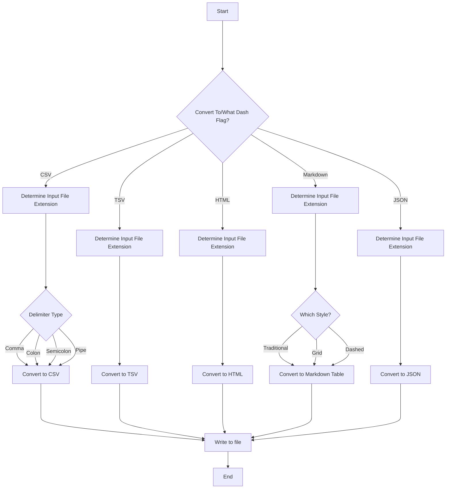

**Contents**

- [Introduction](#introduction)
- [Program Flow](#program-flow)
	- [Main Flow](#main-flow)
- [Testing](#testing)

- - -

# Introduction

This file is to document the development process of the project. It's also used for anyone who wants to contribute or just learn from it.

# Program Flow

## Main Flow

The following is the main flow of execution. It is made to be as abstract and general as possible to allow for some flexibility in the development.

# Testing

To test the code, run the program and use the test files in `tests` folder.

*Note:* In the future, we will try to use actual testing automation.

