# Introduction

This file is to document the development process of the project. It's also used for anyone who wants to contribute or just learn from it.

# Program Flow

## Main Flow

The following is the main flow of execution. It is made to be as abstract and general as possible to allow for some flexibility in the development.

