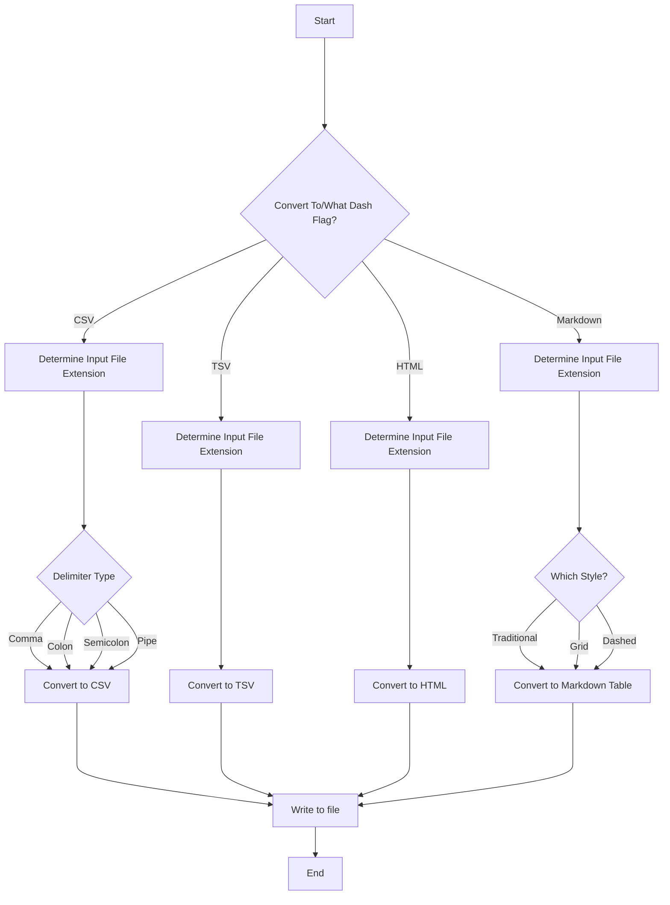

```mermaid
flowchart TD;
start[Start]
ed[End]
wrtf[Write to file]

to{Convert To/What Dash Flag?}
md_style{Which Style?}
delimiter{Delimiter Type}
md[Convert to Markdown Table]
csv[Convert to CSV]
dfe1[Determine Input File Extension]
dfe2[Determine Input File Extension]
dfe3[Determine Input File Extension]
dfe4[Determine Input File Extension]
tsv[Convert to TSV]
html[Convert to HTML]

start ----> to
to --CSV--> dfe1
dfe1 ----> delimiter
to --TSV--> dfe2 
dfe2 ----> tsv
to --HTML--> dfe3
dfe3 ----> html
to --Markdown--> dfe4
dfe4 ----> md_style

delimiter --Comma--> csv
delimiter --Colon--> csv
delimiter --Semicolon--> csv
delimiter --Pipe--> csv

md_style --Traditional--> md 
md_style --Grid--> md
md_style --Dashed--> md

csv ----> wrtf
tsv ----> wrtf
html ----> wrtf
md ----> wrtf

wrtf --> ed
```
